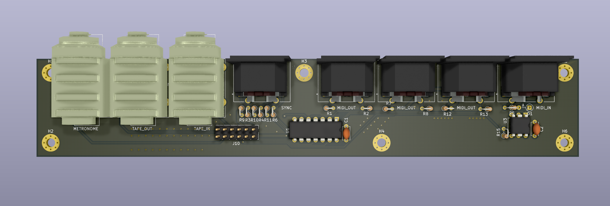

# MCB-1

This is a rebuild of the MCB-1 for anybody who has the sound card it connects to. I will improve the documentation around assembly once I have made one of the boards. Until the docs improve assume it is a work in progress. I will save gerbers in releases setup for JLCPCB. This board is entirely through hole design so should be easy to assemble.

# TODO

* [X] Layout rev0.1
* [ ] Make a board and get it tested
* [ ] Paint the Neutrik 6.5mm socket model
* [ ] Add an assembly and debugging guide

There have been a few modifications to improve availability of parts and reliability of operation.

